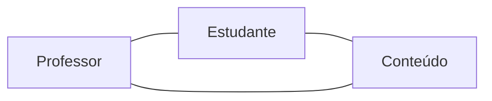

Atitude e comportamento do professor ao tratar um conteúdo de modo que o estudante compreenda, produza conhecimento e possa interferir na realidade — o valor não está em transmitir o que a internet já entrega.

## Ideia Central
- **Mediador** (professor) e **mediado** (estudante): ambos ativos. Diálogo, estímulo, orientação; atividades de interação, problematização, pesquisa, decisão e [[Resolução de Problemas|resolução de problemas]].
- Conteúdo já está na rede; só vira conhecimento se o estudante interage com ele **e** com pessoas (professor, colegas).
- O professor não precisa saber tudo antes: debate, ajuda a criticar o que o aluno encontrou e também aprende com isso.

## Quando
- **Usar:** quando o conteúdo é acessível e o ganho está em provocar, orientar e discutir.
- **Evitar:** aula como transmissão + aluno ouvinte/memorizador; professor como único dono da informação.

## Conexões
- [[Ambiente de Ensino e Aprendizagem a Distância]]
- [[Tecnologia no Ensino]]
- [[Ambiente Virtual de Aprendizagem]]
- [[MBA Engenharia de Software]]
- [[Resolução de Problemas]]
