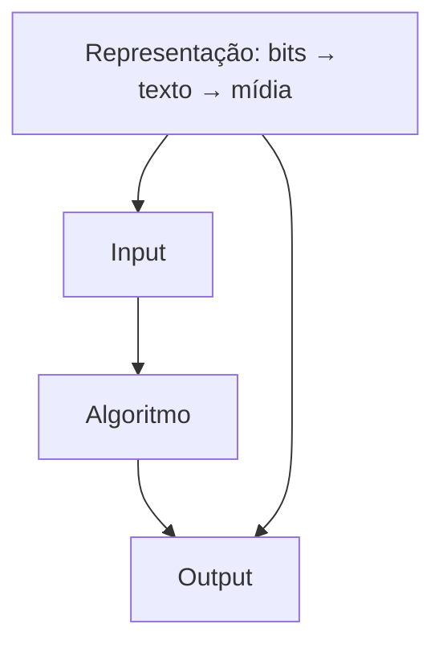

Hub da Week 0 (CS50 — Harvard): fundamentos de representação da informação, pensamento computacional e primeiros blocos de programação (Scratch).

> Objetivo do curso: aprender a **pensar** (resolver problemas); programar é efeito colateral. Você permanece no comando; IA é copiloto.

## Mapa da Week 0

| Tema | Notas |
|---|---|
| Problema | [[Resolução de Problemas]] |
| Bits / bases | [[Bit e Byte]], [[Sistema Binário]] |
| Texto | [[ASCII]], [[Unicode]] |
| Mídia | [[RGB e Pixels]] |
| Processo | [[Algoritmo]], [[Eficiência de Algoritmos]], [[Pseudocódigo]] |
| Código | [[Função]], [[Condicional]], [[Expressão Booleana]], [[Loop]], [[Scratch]] |
| Hábito | [[Rubber Duck Debugging]] |
| Ponte Alberta | [[Abstração]], [[Pensamento de Caixa Preta]] |

## Conexões
- [[Pendências Engenharia de Software]]
- [[Resolução de Problemas]]
- [[Bit e Byte]]
- [[Algoritmo]]
- [[Scratch]]
- [[Abstração]]
- [[Pensamento de Caixa Preta]]
- [[MBA Engenharia de Software]]
- [[Especialização em Design e Arquitetura de Software]]
