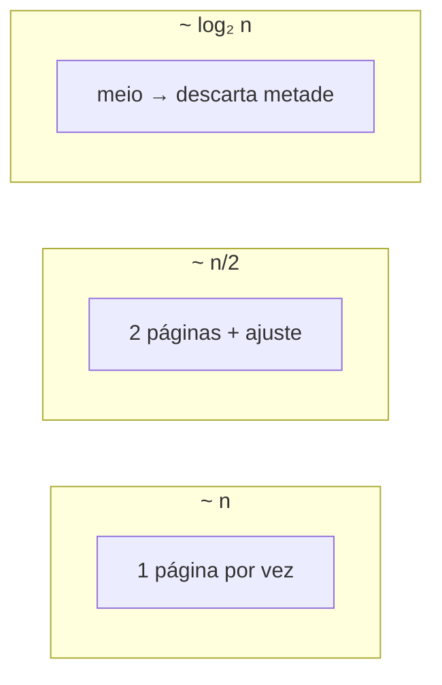

Quão rápido (ou com que recurso) um [[Algoritmo]] cresce quando o **tamanho do problema** *n* aumenta — correto ≠ bom o bastante.

## Ideia Central
Exemplo da lista telefônica (*n* páginas):

- Linear: dobrar *n* ≈ dobrar o tempo.
- Logarítmico (dividir ao meio): dobrar *n* ≈ **+1** passo.
- Meta de bom design: correto **e** eficiente (CPU, RAM, tempo, dinheiro).

## Quando
- **Usar:** comparar abordagens quando *n* pode ficar grande (dados, usuários).
- **Evitar:** otimizar cedo demais um *n* minúsculo — clareza primeiro.

## Conexões
- [[Algoritmo]]
- [[Resolução de Problemas]]
- [[CS50]]
