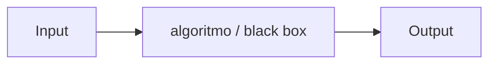

Estudo e prática de transformar um **input** (problema) em **output** (solução) por meio de um processo no meio — o “molho secreto” ([[Algoritmo]] / [[Pensamento de Caixa Preta]]).

## Ideia Central

- Ciência da computação ≈ estudo da **informação** + **[[Resolução de Problemas|resolução de problemas]]**.
- Pensamento computacional: aplicar ideias de CS a problemas do mundo real.
- Computadores são ferramentas; o essencial é o raciocínio.

## Quando
- **Usar:** decompor qualquer desafio em “o que entra / o que sai / como transformar”.
- **Evitar:** pular direto para código sem definir input, output e restrições.

## Conexões
- [[CS50]]
- [[Algoritmo]]
- [[Pensamento de Caixa Preta]]
- [[Abstração]]
- [[Pseudocódigo]]
