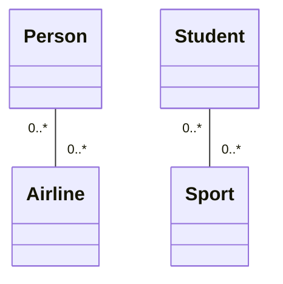

Relação de [[Decomposição]] mais frouxa: dois objetos interagem por um tempo (um usa serviços/métodos do outro), sem pertencimento estrutural. Ambos existem de forma independente.

## Sinais
- Nenhum objeto “é dono” do outro.
- Destruir um não implica destruir o outro.
- Cardinalidade tipicamente livre (ex: `0..*` dos dois lados).

## UML
Linha reta entre as classes (sem diamante).



## Código (usa, não possui)
```java
public class Student {
    public void play(Sport sport) {
        sport.start();
    }
}
```

O `Sport` é passado/usado; o `Student` não guarda posse exclusiva dele.

## Quando
- **Usar:** interação frouxa entre objetos independentes, sem posse estrutural.
- **Evitar:** se há *has-a* real (posse) — use [[Agregação]] ou [[Composição]].

## Conexões
- [[Decomposição]]
- [[Agregação]]
- [[Composição]]
- [[Cardinalidade UML]]
- [[Diagrama de Classes]]
