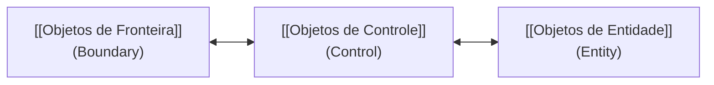

Três papéis no OOD (padrão ECB): entidade (domínio), fronteira (mundo externo) e controle (orquestração). Sem os três, o domínio absorve UI e fluxo e o design endurece.

## Categorias de Objetos

| Categoria | Função Principal | Momento de Descoberta | Exemplo |
| :--- | :--- | :--- | :--- |
| **[[Objetos de Entidade]]** | Representar dados e regras do mundo real (atributos e automodificações). | Requisitos / Design Conceitual | *Cliente*, *Cadeira*, *Carrinho de Compras* |
| **[[Objetos de Fronteira]]** | Intermediar a comunicação com sistemas externos, Internet ou UI do usuário. | Design Técnico / Implementação | *TelaDeLogin*, *APIGateway*, *HttpClient* |
| **[[Objetos de Controle]]** | Coordenar, orquestrar a lógica e manter baixo acoplamento entre outros objetos. | Decomposição / Design Técnico | *Mediator*, *OrderController*, *GerenciadorDeSessão* |

> 💡 **Importante:** Sistemas complexos sustentáveis não consistem apenas de objetos de entidade. A introdução de fronteiras e controles evita que entidades fiquem sobrecarregadas com responsabilidades de UI ou infraestrutura.

## Conexões
- [[Design Orientado a Objetos]]
- [[Design Conceitual]]
- [[Design Técnico]]
- [[Objetos de Entidade]]
- [[Objetos de Fronteira]]
- [[Objetos de Controle]]
