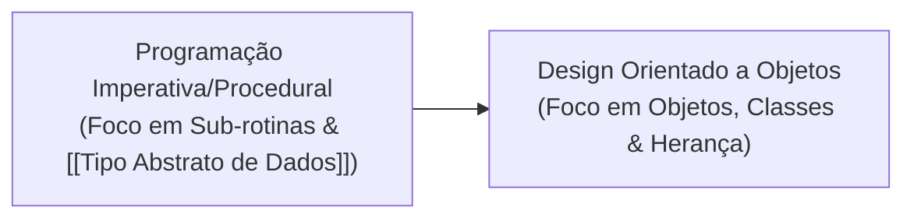

Paradigma de desenvolvimento que modela o software como um conjunto de objetos interativos, mapeando conceitos do mundo real diretamente para o código para reduzir a lacuna semântica entre o problema e a solução.

## Evolução dos Paradigmas

*(Veja a nota completa: [[Evolução dos Paradigmas de Programação]])*

- **Programação Top-Down (Procedural):**
  - **Abordagem:** Mapeia processos do problema em uma árvore de sub-rotinas/procedimentos.
  - **Uso Comum:** Processamento de dados linear.
  - **Limitação:** Grande "salto mental" (lacuna semântica) entre os conceitos do domínio e a estrutura do código; falta de herança nativa entre **[[Tipo Abstrato de Dados]]**.
- **Design Orientado a Objetos (OOD):**
  - **Abordagem:** Representa o domínio por meio de objetos construídos a partir de classes (extensão dos tipos abstratos de dados).
  - **Benefício:** Alinhamento de termos, encapsulamento e reaproveitamento através de herança e polimorfismo.

---

## Ciclo do Design OO

O design ocorre de forma contínua e iterativa em duas fases principais:

### 1. Análise Orientada a Objetos (OOA)
- **Foco:** Espaço do Problema ([[Design Conceitual]]).
- **Ação:** Identificar os objetos essenciais do domínio.
- **Artefatos:** Foco inicial em **[[Objetos de Entidade]]**.

### 2. Design Orientado a Objetos (OOD)
- **Foco:** Espaço da Solução ([[Design Técnico]]).
- **Ação:** Refinar atributos e comportamentos dos objetos.
- **Artefatos:** Introdução de **[[Objetos de Controle]]** e **[[Objetos de Fronteira]]** para viabilizar o sistema.

---

## Modelagem e UML

A modelagem simplifica a complexidade e serve como documentação de design.
- **[[Cartões CRC]]:** croquis — prototipar e simular o [[Design Conceitual]].
- **[[UML]] / [[Diagrama de Classes]]:** planta da **estrutura**.
- **[[Diagrama de Sequência]]:** planta do **comportamento** (mensagens no tempo para uma tarefa).
- **[[Diagrama de Estados]]:** planta do **ciclo de vida** de um objeto (estados + eventos).
- **Bidirecional (classes):** diagrama → esqueleto Java e código → diagrama.

---

## Princípios Fundamentais (OOM)

Para lidar com a complexidade e atingir qualidades de software (reusabilidade, flexibilidade e manutenibilidade), aplica-se o meta-princípio de **[[Separação de Preocupações]]** através de quatro princípios básicos:
1. **[[Abstração]]**: Focar no essencial, ocultando detalhes.
2. **[[Encapsulamento]]**: Agrupar dados e comportamentos, expor interface e restringir o interno ([[Ocultação de Informação]]).
3. **[[Decomposição]]**: Dividir o todo em partes com responsabilidades distintas (e vice-versa).
4. **[[Generalização]]**: Reduzir redundância extraindo o comum (métodos e [[Herança]]); contratos de tipo via [[Interface]].

## Avaliar a Estrutura
Aplique [[Separação de Preocupações]] para ↑ [[Coesão]] / [[Modularidade]]; avalie com [[Complexidade de Design]] ([[Acoplamento]] baixo, [[Coesão]] alta). Busque [[Integridade Conceitual]]. Comportamento: [[Diagrama de Sequência]] e [[Diagrama de Estados]]. Correção do modelo de estados: [[Model Checking]].

## Conexões
- [[Separação de Preocupações]]
- [[Integridade Conceitual]]
- [[Modularidade]]
- [[Especialização em Design e Arquitetura de Software]]
- [[Design de Software]]
- [[Arquitetura vs Design de Software]]
- [[Complexidade de Design]]
- [[UML]]
- [[Diagrama de Classes]]
- [[Diagrama de Sequência]]
- [[Diagrama de Estados]]
- [[Model Checking]]
- [[Design Conceitual]]
- [[Design Técnico]]
