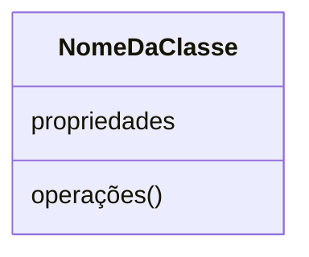
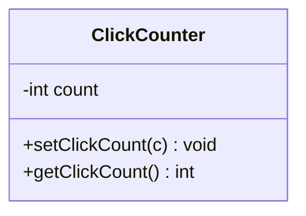

Diagrama [[UML]] que representa uma [[Abstração]] como classe, com detalhe próximo o bastante do código para guiar a implementação — e conversível em ambas as direções (diagrama ↔ código).

## Estrutura da Caixa (3 seções)

- **Propriedades:** nome + tipo (primitivo ou classe).
- **Operações:** nome + parâmetros + tipo de retorno.
- **[[Visibilidade UML]]:** `+` `#` `~` `-` — [[Ocultação de Informação]] / [[Encapsulamento]] no diagrama ([[Modificadores de Acesso]]).

## Mapeamento ↔ Código
| Diagrama | Java |
|---|---|
| Nome da classe | `class Nome` |
| Propriedade | variável de membro |
| Operação | método |
| `+` / `#` / `~` / `-` | `public` / `protected` / default / `private` |
| *itálico* / `{abstract}` | `abstract` (classe ou operação) — [[Classe Abstrata]] |

Conversão inversa: identificar classe → propriedades a partir dos atributos → operações a partir dos métodos (com params e retorno).

### Exemplo básico (`ClickCounter`)


```java
public class ClickCounter {
    private int count;

    public void setClickCount(int c) {
        count = c;
    }

    public int getClickCount() {
        return count;
    }
}
```

> Exemplo com validação em setter: ver [[Encapsulamento]] (`Student`).

## Relacionamentos (todo ↔ parte)
| UML | Relação | Notas |
|---|---|---|
| `———` linha | [[Associação]] | interação frouxa |
| `◇——` diamante vazio | [[Agregação]] | *has-a* fraco |
| `◆——` diamante cheio | [[Composição]] | *has-a* forte |
| `0..*`, `1`, … | [[Cardinalidade UML]] | quantos de cada lado |

Detalhes e código: ver [[Decomposição]].

## Relacionamento (generalização / tipos)
| UML | Relação | Notas |
|---|---|---|
| `──▷` seta sólida p/ cima | [[Herança]] | cabeça = superclasse; não repetir o herdado na subclasse |
| `╌╌▷` seta tracejada p/ cima | [[Interface]] (`implements`) | cabeça = `«interface»`; cauda = classe |
| `#` | [[Visibilidade UML]] | `protected` — visível às subclasses |

Detalhes e código: ver [[Generalização]] / [[Herança]] / [[Interface]].

## Quando
- **Usar:** design técnico próximo do código (blueprint para implementar).
- **Evitar:** brainstorming inicial — prefira [[Cartões CRC]] nessa fase.

## Conexões
- [[UML]]
- [[Cartões CRC]]
- [[Abstração]]
- [[Encapsulamento]]
- [[Ocultação de Informação]]
- [[Modificadores de Acesso]]
- [[Visibilidade UML]]
- [[Getters e Setters]]
- [[Decomposição]]
- [[Associação]]
- [[Agregação]]
- [[Composição]]
- [[Cardinalidade UML]]
- [[Generalização]]
- [[Herança]]
- [[Interface]]
- [[Subtipagem]]
- [[Polimorfismo]]
- [[Classe Abstrata]]
- [[Sobrescrita de Método]]
- [[Design Técnico]]
- [[Design Conceitual]]
- [[Design Orientado a Objetos]]
