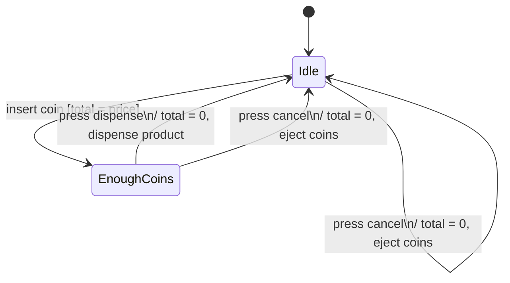

Diagrama [[UML]] que mostra o **ciclo de vida de um objeto**: os estados em que ele existe e os eventos que o fazem mudar.

## Ideia Central
- Complementa o [[Diagrama de Classes]] (estrutura) e o [[Diagrama de Sequência]] (conversa entre objetos): aqui o foco é **um** objeto reagindo a eventos — não a progressão de mensagens entre vários.
- **Estado:** como o objeto existe num instante — determinado pelos valores dos atributos (carro automático: park, reverse, neutral, drive). Em cada estado, só certos comportamentos são possíveis.
- **Composto:** estado que contém subestados. O objeto está no pai **e** num filho (ex: `Matrícula` engloba “aberta” e “fechada”). Use quando um passo do ciclo de vida tem fases internas.
- Útil em sistemas reativos (o próximo estado depende do evento), para achar evento esquecido (ex: cancelar) e para guiar testes por estado. [[Model Checking]] verifica esse modelo explorando os estados alcançáveis.

## Notação
| Elemento | Desenho | Significado |
|---|---|---|
| Início | círculo cheio | estado inicial |
| Estado | retângulo arredondado | nome; opcional: variáveis e atividades |
| Composto | retângulo com estados dentro | um estado com subestados |
| Transição | seta | evento `[guarda]` `/` ação |
| Escolha | losango | ramifica por condição (alternativa a várias guardas) |
| Término | círculo com ponto | processo/região concluído (opcional) |

### Dentro do estado
- **Nome** — obrigatório e significativo (`Idle`, `Reverse`).
- **Variáveis** — dados relevantes naquele estado (ex: `total` de moedas; turma `full` quando matrículas = capacidade).
- **Atividades:** `entry` (ao entrar), `do` (enquanto permanece), `exit` (ao sair). Relógio no estado ringing: `entry` solta a mola; `do` toca o sino; `exit` relock a mola.

### Rótulo da transição
Tem **evento** (o disparo). Pode ter **guarda** (só transita se verdadeira) e **ação** (efeito da transição). Auto-transição = seta que volta ao mesmo estado. Ramificações: várias setas com guardas, ou um losango de escolha.

## Exemplo (máquina de vendas)
Idle: variável `total`; `entry / display total`. EnoughCoins: `entry / display enough coins`. Sem término — o processo não acaba.

Término (não usado aqui): o processo acaba — ex. ATM devolve o cartão ([[Estudo de Caso - Caixa Eletrônico]]).

## Quando
- **Usar:** objeto com ciclo de vida claro ou sistema reativo (próximo estado depende do evento); descobrir eventos/condições faltando; montar testes por estado.
- **Evitar:** objeto sem estados relevantes; no lugar de [[Diagrama de Sequência]] (não mostra colaboração) ou [[Diagrama de Classes]] (não mostra estrutura). Processos contínuos podem omitir término.

## Conexões
- [[UML]]
- [[Diagrama de Sequência]]
- [[Diagrama de Classes]]
- [[Encapsulamento]]
- [[Design Técnico]]
- [[Design Orientado a Objetos]]
- [[Estudo de Caso - Caixa Eletrônico]]
- [[Model Checking]]
