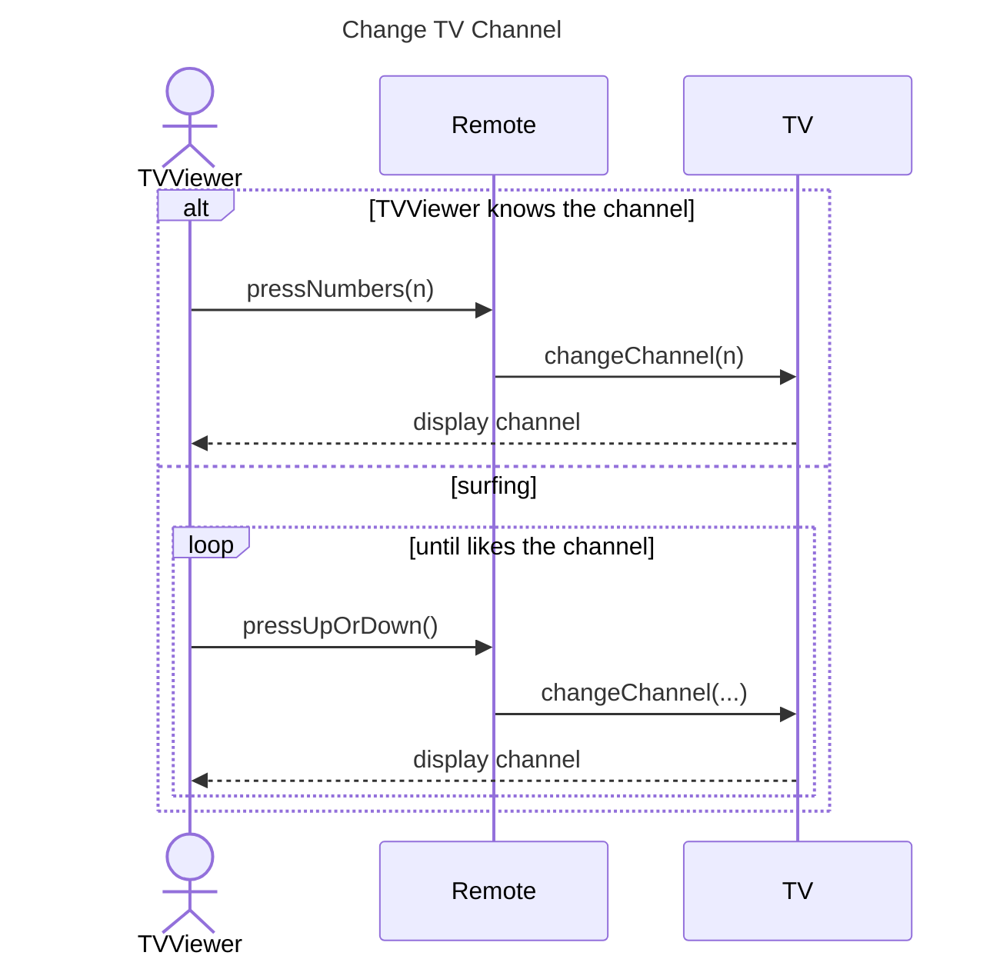

Diagrama [[UML]] que mostra **como objetos interagem no tempo** para completar uma tarefa específica — o “mapa da conversa” entre objetos (e atores).

## Ideia Central
- Complementa o [[Diagrama de Classes]] (estrutura) com o **comportamento dinâmico** de um cenário.
- Pré-requisito: saber decompor o sistema em classes/objetos.
- Título significativo (ex: `Change TV Channel`); o time usa como referência de desenvolvimento.
- Objetos da esquerda para a direita na ordem em que interagem; pessoas = **atores** (stick figure).

## Elementos
| Elemento | Notação | Significado |
|---|---|---|
| Participante | caixa com nome da classe / papel | objeto no cenário |
| Ator | stick figure | humano que inicia/usa o sistema |
| Linha de vida | linha tracejada vertical | o objeto ao longo do tempo |
| Ativação | retângulo fino na linha de vida | enviando, recebendo ou esperando mensagem |
| Mensagem | seta **sólida** → | chamada / envio (ex: `pressNumbers(n)`) |
| Retorno | seta **tracejada** ← | devolve dado/controle |
| Frame | caixa envolvendo trechos | pode aninhar outras sequências (ex: ATM: saque + depósito) |

## Controle de fluxo
- **`alt`:** alternativas com condição (ex: “sabe o canal” vs `else` surfar canais).
- **`loop`:** repete enquanto a condição for verdadeira (ex: enquanto não gostar do canal).

## Exemplo (esqueleto)

Mensagens costumam mapear para **métodos** que você vai implementar.

## Quando
- **Usar:** planejar/comunicar um fluxo objeto-a-objeto antes de codar; descobrir operações faltando ou problemas de colaboração.
- **Evitar:** como substituto do [[Diagrama de Classes]] (não modela estrutura); ou diagramas gigantes sem frames — prefira cenários focados / aninhados.

## Conexões
- [[UML]]
- [[Diagrama de Classes]]
- [[Design Técnico]]
- [[Cartões CRC]]
- [[Design Orientado a Objetos]]
- [[Decomposição]]
