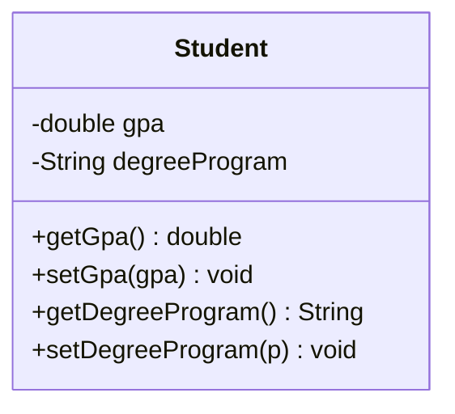

Princípio de design que forma um objeto autocontido ao agrupar dados e comportamentos, expor uma interface pública e restringir o acesso aos detalhes internos. É o meio prático de aplicar [[Ocultação de Informação]].

## Três Ideias
- **Agrupamento:** Atributos (dados) e métodos (comportamentos) que os manipulam ficam juntos na mesma classe.
- **Exposição:** Interface pública pela qual outros objetos usam a classe (o que revelar).
- **Restrição:** Estado e detalhes internos acessíveis apenas de dentro do objeto (o que esconder) — via [[Modificadores de Acesso]].

## Relação com Abstração
- [[Abstração]] decide *quais* atributos e comportamentos são relevantes no contexto.
- Encapsulamento garante que essas características fiquem *agrupadas* na mesma classe, com acesso controlado.
- Cada objeto guarda só o que lhe é relevante (ex: Curso conhece seus alunos; Professor conhece suas disciplinas — não a lista completa da universidade).

## Na Prática (design + código)
- No [[Diagrama de Classes]]: `+` `#` `~` `-` ([[Visibilidade UML]] / [[Modificadores de Acesso]]).
- Atributos sensíveis ficam privados; o mundo externo passa por métodos aprovados — tipicamente [[Getters e Setters]] (um “portão” que controla *como* e *quando* o dado muda).
- Getters/setters **não** precisam só ler/escrever: podem validar (ex: só muda o curso se GPA > 2.7). O consumidor não vê a regra — só o contrato ([[Pensamento de Caixa Preta]]).
- Esconda o que pode mudar (implementação); revele só premissas estáveis da interface ([[Ocultação de Informação]]).

### Exemplo (`Student`)


```java
public class Student {
    private double gpa;
    private String degreeProgram;

    public double getGpa() { return gpa; }

    public void setGpa(double gpa) {
        if (gpa >= 0 && gpa <= 4.0) this.gpa = gpa;
    }

    public String getDegreeProgram() { return degreeProgram; }

    public void setDegreeProgram(String program) {
        if (gpa > 2.7) this.degreeProgram = program;
    }
}
```

## Benefícios
- **Integridade dos Dados:** Estado só muda via métodos, preservando invariantes e dependências internas.
- **Informação Sensível:** Pode responder consultas derivadas (ex: "em boa situação?") sem revelar o valor bruto (ex: GPA).
- **Mudanças Isoladas:** Interface estável; implementação pode mudar sem afetar consumidores ([[Pensamento de Caixa Preta]], [[Barreira de Abstração]]).
- **Reutilização:** Consumidores precisam só da assinatura dos métodos (entradas, saídas e efeitos).
- **Baixo [[Acoplamento]]:** Conexões óbvias sem “abrir” o módulo (facilidade) — ver [[Complexidade de Design]].

## Quando
- **Usar:** para proteger invariantes e controlar como o estado muda.
- **Evitar:** campos públicos ou getters/setters vazios como encapsulamento de fachada.

## Conexões
- [[Ocultação de Informação]]
- [[Modificadores de Acesso]]
- [[Design Orientado a Objetos]]
- [[Abstração]]
- [[Visibilidade UML]]
- [[Getters e Setters]]
- [[Diagrama de Classes]]
- [[Pensamento de Caixa Preta]]
- [[Barreira de Abstração]]
- [[Complexidade de Design]]
- [[Acoplamento]]
- [[Coesão]]
- [[Separação de Preocupações]]
- [[Decomposição]]
- [[Generalização]]
- [[Tipo Abstrato de Dados]]
