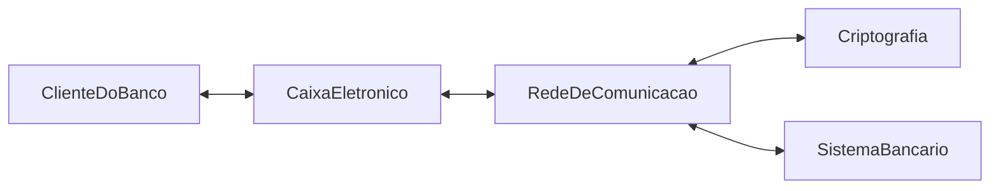

Demonstração prática da evolução e descoberta de componentes ocultos utilizando a técnica de [[Cartões CRC]].

## Requisitos Iniciais (Simplificados)
Um caixa eletrônico (*Bank Machine*) onde o cliente insere o cartão, digita a senha de autenticação e escolhe sacar, depositar ou consultar saldo.

---

## 1. Mapeamento Inicial com [[Cartões CRC]]

### Cartão 1: `ClienteDoBanco`
- **Responsabilidades:** Inserir cartão bancário; Selecionar operação (sacar, depositar, saldo).
- **Colaboradores:** `CaixaEletronico`

### Cartão 2: `CaixaEletronico`
- **Responsabilidades:** Autenticar cliente; Exibir opções de tarefa; Processar operações.
- **Colaboradores:** `ClienteDoBanco`

---

## 2. Descoberta de Componentes Ocultos via Simulação
Ao simular o fluxo na mesa com a equipe (*"Como o Caixa Eletrônico autentica o cliente?"*), descobre-se que o caixa não faz isso sozinho. Surgem novos componentes:

- **[[Objetos de Fronteira]] / Subcomponentes do Caixa:**
  - `LeitorDeCartao`, `TecladoNumérico`, `TelaDisplay`, `DispensadorDeNotas`, `EntradaDeCheque`.
- **Infraestrutura e Segurança:**
  - `RedeDeComunicacao`, `Criptografia`, `SistemaBancario`.

## Conexões
- [[Cartões CRC]]
- [[Design Conceitual]]
- [[Design Técnico]]
- [[Categorias de Objetos]]
