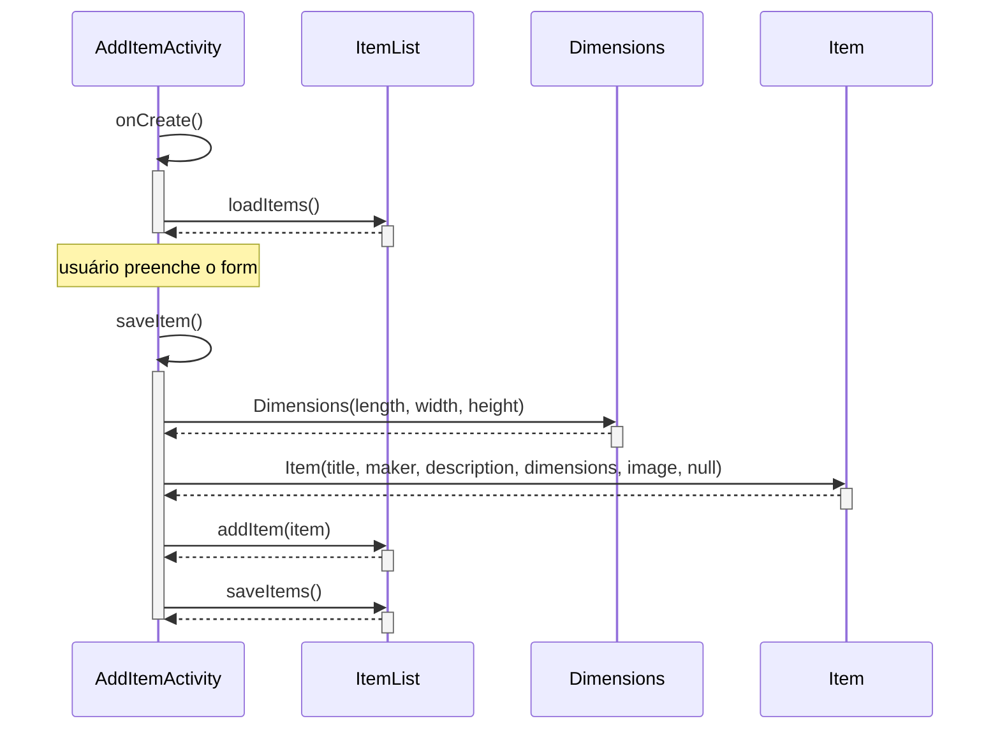

Fluxo do Sharing App ao adicionar um item: a tela (`AddItemActivity`) carrega a lista persistida e, ao salvar, cria `Dimensions` e `Item`, inclui na `ItemList` e grava.

Alberta Course 1 — capstone 1.2 (aula 1.3.6). A ativação de `AddItemActivity` **começa** em `onCreate()`. Há duas ativações: abrir a tela, depois o clique em Save. `AddItemActivity` é [[Objetos de Fronteira|fronteira]]; `Item` e `Dimensions` são [[Objetos de Entidade|entidade]]. `Item` recebe um `Dimensions` já construído ([[Composição]]).

## Ordem (código, não chute)

| # | Mensagem | Quem → quem | Por quê |
|---|---|---|---|
| 1 | `onCreate()` | `AddItemActivity` → ela mesma | Android abre a tela; o template já traz esta mensagem. |
| 2 | `loadItems()` | `AddItemActivity` → `ItemList` | Ainda no `onCreate`: lê `items.sav` para a lista em memória. |
| 3 | `saveItem()` | `AddItemActivity` → ela mesma | Clique em Save (depois do form). Template já traz. |
| 4 | `Dimensions(...)` | `AddItemActivity` → `Dimensions` | Construtor: comprimento, largura, altura. |
| 5 | `Item(...)` | `AddItemActivity` → `Item` | Construtor recebe o `Dimensions` pronto (`id == null`). |
| 6 | `addItem()` | `AddItemActivity` → `ItemList` | Inclui o `Item` na coleção. |
| 7 | `saveItems()` | `AddItemActivity` → `ItemList` | Persiste a lista *depois* de adicionar. |

`loadItems` **não** fica dentro de `saveItem`. `Dimensions` antes de `Item`. `addItem` antes de `saveItems`.

Se o canvas do curso já mostrar `addImage()` e `setId()` na linha de `: Item`, deixe-os **dentro** do construtor (`id == null` gera o UUID). Não invente outros métodos.

```java
item_list.loadItems(context); // em onCreate

Dimensions dimensions = new Dimensions(length_str, width_str, height_str);
Item item = new Item(title_str, maker_str, description_str, dimensions, image, null);
item_list.addItem(item);
item_list.saveItems(context);
```

## Diagrama



PlantUML no formato do template (colar no editor do Coursera):

```
@startuml
participant "AddItemActivity" as A
participant "ItemList" as IL
participant "Dimensions" as D
participant "Item" as I

A -> A ++ : onCreate()
A -> IL ++ : loadItems()
return
deactivate A

A -> A ++ : saveItem()
A -> D ++ : Dimensions()
return
A -> I ++ : Item()
return
A -> IL ++ : addItem()
return
A -> IL ++ : saveItems()
return
deactivate A
@enduml
```

## Conexões
- [[Diagrama de Sequência]]
- [[Diagrama de Classes]]
- [[Objetos de Fronteira]]
- [[Objetos de Entidade]]
- [[Composição]]
- [[Design Técnico]]
- [[UML]]
