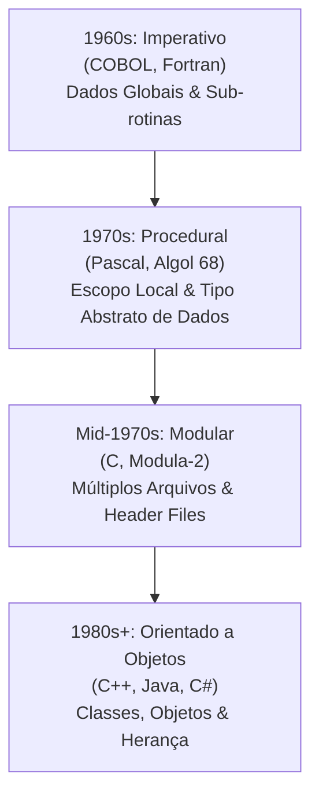

Transformação histórica nas formas de estruturar o código e gerenciar dados, impulsionada pela mudança de gargalos no desenvolvimento: da busca por desempenho de hardware para o ganho de produtividade humana e gestão de complexidade.

## Linha do Tempo e Evolução

### 1. Anos 1960 — Paradigma Imperativo e Dados Globais
- **Contexto:** Tempo de processamento do computador era extremamente caro.
- **Linguagens:** COBOL, Fortran.
- **Estrutura:** Programas divididos em sub-rotinas acessando variáveis em memória **global** para maximizar performance.
- **Problema/Gargalo:** Alterações acidentais em dados globais geravam efeitos colaterais graves e estados imprevisíveis.

### 2. Anos 1970 — Procedimentos, Escopo Local e ADTs
- **Contexto:** Necessidade de melhor controle e isolamento de dados.
- **Linguagens:** Pascal, Algol 68.
- **Inovações:**
  - Variáveis de escopo local em procedimentos aninhados (compartimentação).
  - Conceito de **[[Tipo Abstrato de Dados]]** (ADT) para agrupar informações relacionadas criadas pelo programador.

### 3. Meados dos Anos 1970 — Modularização e Arquivos Separados
- **Contexto:** Custo do hardware caiu, enquanto o custo da mão de obra humana e a complexidade dos problemas subiram.
- **Linguagens:** C, Modula-2.
- **Inovações:** Organização do código em múltiplos arquivos e arquivos de cabeçalho (*Header Files* `.h`), permitindo reuso e separação de interface e implementação.
- **Limitação:** Dificuldade em estender ou reutilizar ADTs por ausência de mecanismo nativo de herança.

### 4. Anos 1980 em diante — Design e Programação Orientada a Objetos
- **Contexto:** Necessidade de mimetizar o domínio do problema com alta fidelidade e facilitar a manutenção de grandes sistemas.
- **Linguagens:** C++, Java, C#.
- **Inovações:** ADTs estruturados como **Classes**, suporte nativo a **Herança** e **Polimorfismo**.

---

## Quando Usar / Quando NÃO Usar (Trade-offs)

- **Compreensão de Legados:** Entender a evolução histórica é vital para a manutenção de sistemas legados que ainda operam sob paradigmas imperativos ou procedurais.
- **Escolha Consciente do Paradigma:** Embora a POO seja o paradigma predominante, **ela não é a única ferramenta**. Se um problema puder ser resolvido de forma mais simples e eficiente sem POO (ex: scripts procedurais ou funções puras), a abordagem não-OO deve ser adotada para otimizar o tempo do desenvolvedor — que é o recurso mais caro na criação de software atual.

---

## Conexões
- [[Design Orientado a Objetos]]
- [[Tipo Abstrato de Dados]]
- [[Abstração]]
- [[Encapsulamento]]
- [[Generalização]]
