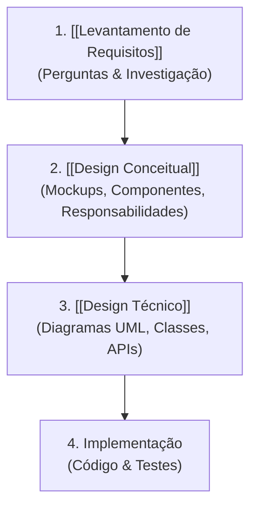

Sequência iterativa para transformação de um problema de negócio em código funcional e sustentável.

## Estágios do Fluxo

> 💡 **Princípio Fundamental:** *"Pense como um arquiteto antes de agir como um construtor."* Ajustar o design no papel previne o custo elevado de reescrever código ou alterar paredes estruturais depois de prontas.

## Benefícios
- Alinhamento de visão com o cliente antes do investimento em código.
- Guia estruturado e desacoplado para a equipe de desenvolvimento.

## Conexões
- [[Arquitetura vs Design de Software]]
- [[Design de Software]]
- [[Estudo de Caso - Casa vs Busca de Cursos]]
