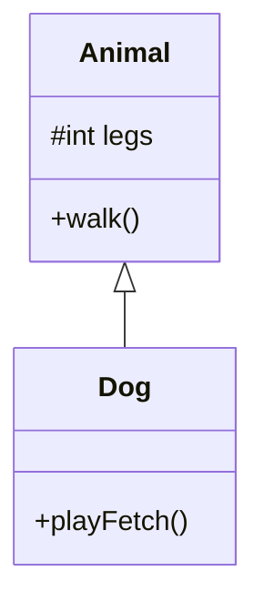

Mecanismo pelo qual uma **subclasse** recebe atributos e comportamentos de uma **superclasse**, permitindo reutilizar o que é comum e especializar o que é específico. É a forma principal de aplicar [[Generalização]] entre classes ([[Herança de Implementação]]).

## Ideia Central
- Relação *"é um"* (ex: Cachorro *é um* Animal).
- Superclasse = generalizada; subclasse = especializada (pode acrescentar e [[Sobrescrita de Método|sobrescrever]]).
- No diagrama e no código: **não** redeclara o que já veio da superclasse — a seta / `extends` já comunica isso.
- Poderosa para reuso e manutenção — **mal aplicada**, cria mais problemas do que resolve.

## UML
Seta sólida com ponta triangular aberta: **cabeça = superclasse**, **cauda = subclasse**. Por convenção, aponta **para cima**.



## Sinais de abuso
1. **Subclasse sem especialização:** só compartilha atributos/comportamentos; não acrescenta nada próprio → a superclasse já basta (ex: `PepperoniPizza extends Pizza` só chama `super` e `addTopping("pepperoni")` — use só `Pizza` com topping).
2. **Quebra [[Princípio de Substituição de Liskov]]:** subclasse altera o contrato esperado da superclasse (ex: `Whale` “herda” `walk`/`run` de `Animal` e troca por natação).
3. **API inchada por herança errada:** ex. Java `Stack extends Vector` → stack ganha `get(index)`, `insertElementAt`, etc., que **não** são comportamento de pilha (LIFO: `push`/`pop`/`peek`).

Se herança não cabe: prefira [[Decomposição]] (ex: `SmartPhone` *tem* `Phone` e `Camera`, em vez de estender `Phone` e misturar métodos de câmera).

## Na Prática (Java)
| Conceito | Java |
|---|---|
| Herdar | `class Dog extends Animal` |
| Chamar super | `super(...)` |
| Não instanciar a geral | `abstract class` ([[Classe Abstrata]]) |
| Protegido | `protected` → `#` ([[Visibilidade UML]]) |

```java
public abstract class Animal {
    protected int legs;
    public Animal(int legs) { this.legs = legs; }
    public void walk() { System.out.println("walking"); }
}

public class Dog extends Animal {
    public Dog() { super(4); }
    public void playFetch() { /* especialização real */ }
}
```

## Quando
- **Usar:** *é-um* verdadeiro + especialização real na subclasse + respeita [[Princípio de Substituição de Liskov]].
- **Evitar:** só para compartilhar código; ou quando a relação é *tem-um* — use [[Decomposição]] / [[Composição]].

## Conexões
- [[Princípio de Substituição de Liskov]]
- [[Generalização]]
- [[Herança de Implementação]]
- [[Decomposição]]
- [[Classe Abstrata]]
- [[Sobrescrita de Método]]
- [[Diagrama de Classes]]
- [[DRY]]
